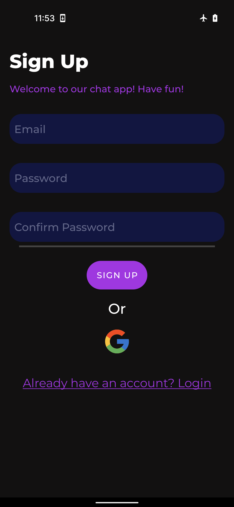
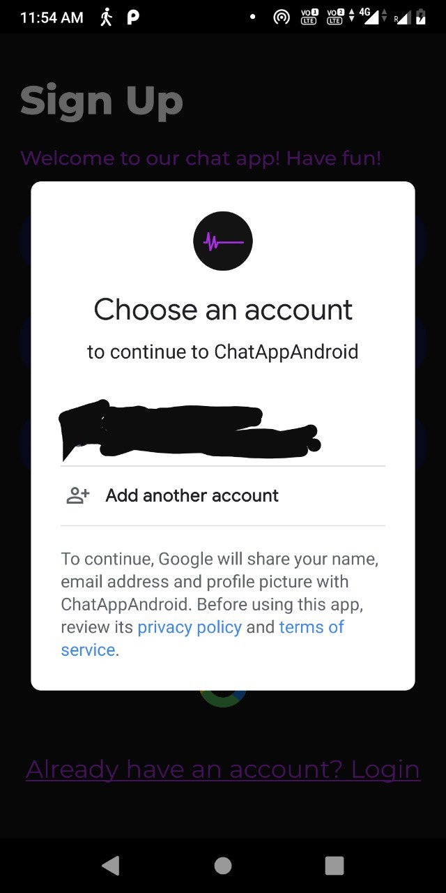
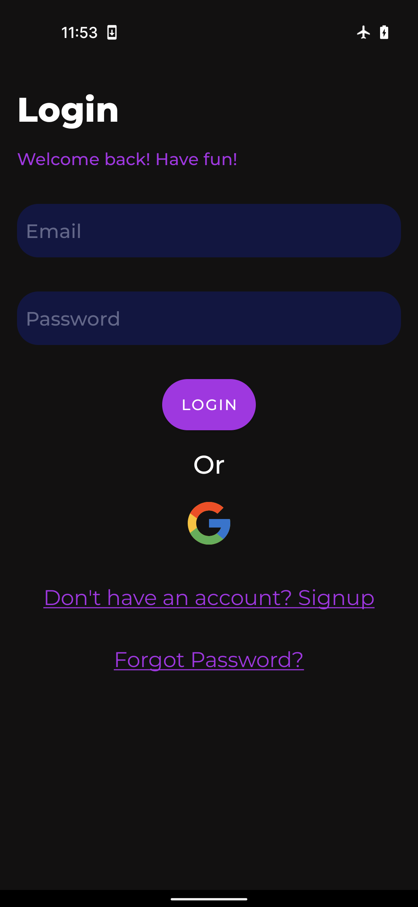
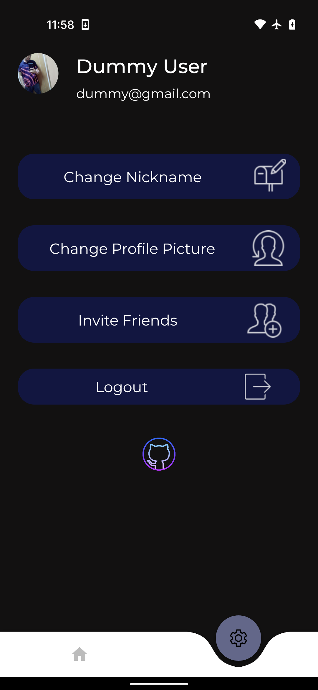
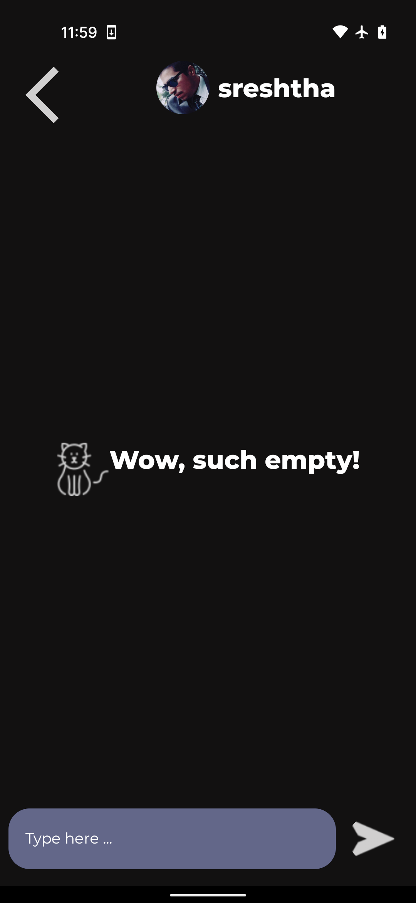
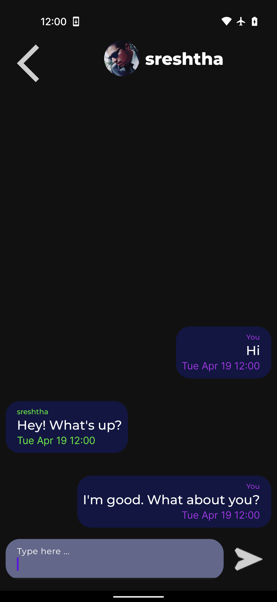

# Chat App Android

## About

A chat app for Android written in Kotlin using MVVM.

## Features

1. Authentication:
    * Email and password
    * Google Auth

2. Reset Password

2. Sending and Receiving messages

3. User can update their profile by adding profile pictures, nicknames, etc.

## Permissions

1. Internet
2. Read External Storage

## Dependencies

1. [Kotlin](https://kotlinlang.org/docs/home.html)

2. [Coroutines](https://developer.android.com/kotlin/coroutines)

3. [Dagger Hilt](https://developer.android.com/training/dependency-injection/hilt-android)

4. [Firebase](console.firebase.google.com)

5. [Glide](https://github.com/bumptech/glide)

6. [Curved Bottom Nav](https://github.com/susonthapa/curved-bottom-navigation)

7. [Circular Image View](https://github.com/hdodenhof/CircleImageView)

8. [Navigation Components](https://developer.android.com/guide/navigation/navigation-getting-started)

9. [Dot Loader](https://github.com/bhargavms/DotLoader)

## Limitations

1. Latency is higher than that of chat apps built using websockets.

2. Since, cloud functions are not available in [Spark Plan of Firebase](https://firebase.google.com/pricing), therefore for receiving messages, app has to check constantly for updates.

## Compatibility

Android 9 (api level 28) and above.

## Preview

<table>
  <tr>
    <td></td>
    <td></td>

  </tr>
    <tr>
    <td></td>
    <td></td>

  </tr>
   <tr>
    <td></td>
    <td></td>
    </td>
  </tr>

 <tr>
    <td></td>
    <td></td>
    </td>
  </tr>
 </table>

 ## Upcoming Features
 
1. Group Chats
2. Image Sharing
3. Audio Sharing

## License

This app is licensed under the Apache License Version 2.0 License. See [LICENSE](https://github.com/sreshtha10/ChatAppAndroid/blob/master/LICENSE) for the full license text.
